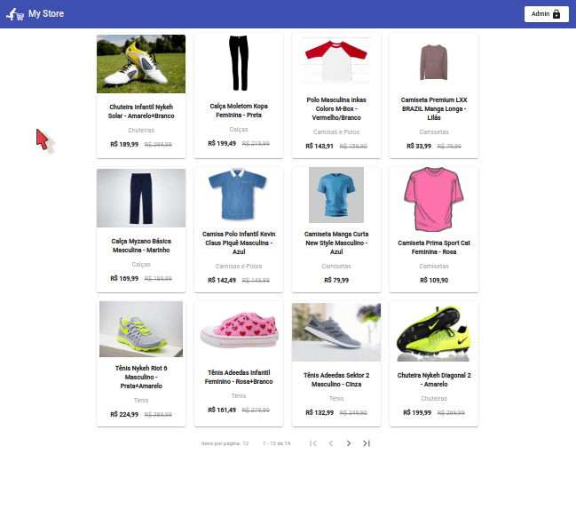
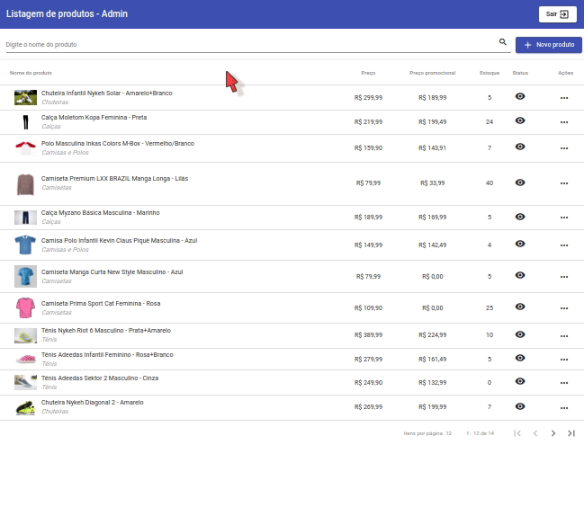
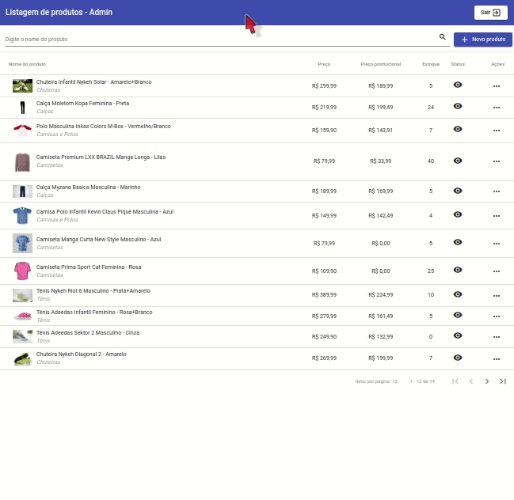
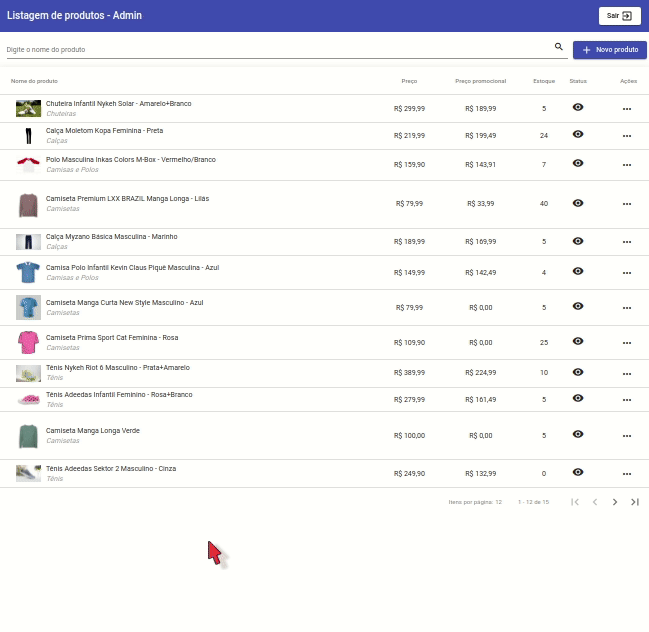
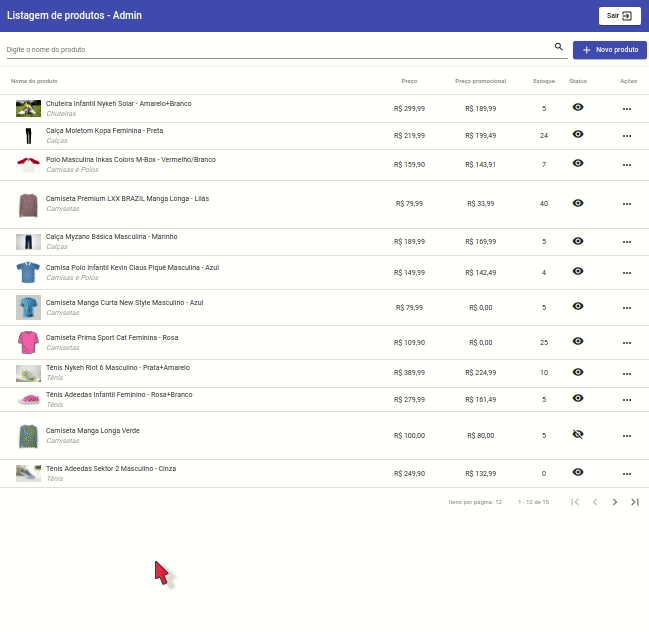
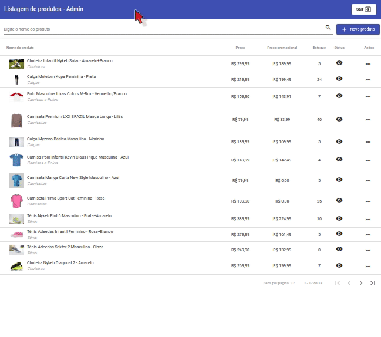
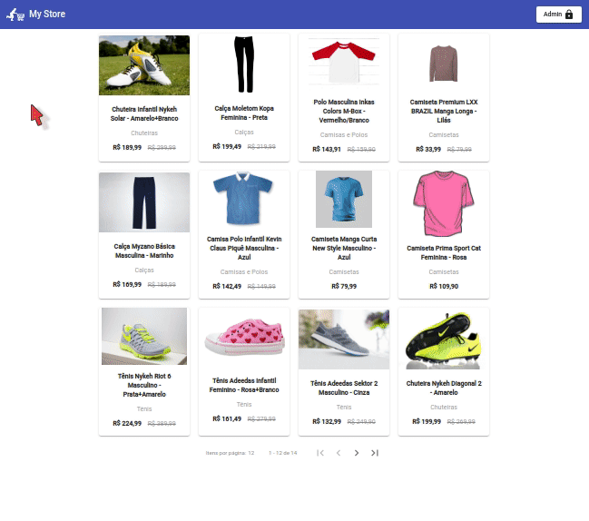

<h1 align="center">My Store</h1>

<p align="center">
    
    
</p>

- [Descrição do Projeto](#descrição-do-projeto)
- [Funcionalidades da Aplicação](#funcionalidades-da-aplicação)
- [Instalação e execução](#instalação-e-execução)
- [Swagger](#swagger)
- [Tecnologias utilizadas](#tecnologias-utilizadas)
- [Pessoas Desenvolvedoras do Projeto](#pessoas-desenvolvedoras-do-projeto)
- [Licença](#licença)

## Descrição do Projeto

My Store é um projeto simples de simulação de um e-commerce, dividido em uma parte administrativa, que possui a listagem dos produtos da loja, com possibilidades de cadastro, pesquisa, edição e remoção, e uma parte de vitrine para os clientes, que possui a listagem dos produtos e os detalhes de um produto. O projeto foi desenvolvido, no frontend, em Angular e Angular Material, no backend, em Node.js com Express, e, para o banco de dados foi utilizado o SQLite. 
<br><br>

## Funcionalidades da Aplicação

- `Entrar na área administrativa`: Caso não esteja na área administrativa e deseja acessá-la, deve-se clicar no botão "Admin", localizado no lado superior direito da tela.
<div align="center">
    
</div>
<br>

- `Entrar na área de vitrine`: Caso esteja na área administrativa e deseja acessar a área de vitrine, deve-se clicar no botão "Sair", localizado no lado superior direito da tela.
<div align="center">
    
</div>
<br>

- `Cadastrar produto`: Para cadastrar um produto, funcionalidade disponível apenas na área administrativa, deve-se clicar em "Novo produto", preencher todos os campos obrigatórios do formulário que se abrirá e clicar em "Salvar". Caso não ocorra erros, o produto será cadastrado com sucesso.
<div align="center">
    
</div>
<br>

- `Editar produto`: Para editar um produto, funcionalidade disponível apenas na área administrativa, deve-se clicar no botão de ações do produto desejado e, em seguida, clicar em "Editar produto". No formulário que se abrirá, deve-se modificar os campos desejados e clicar em "Salvar". Caso não ocorra erros, o produto será atualizado com sucesso.
<div align="center">
    
</div>
<br>

- `Remover produto`: Para remover um produto, funcionalidade disponível apenas na área administrativa, deve-se clicar no botão de ações do produto desejado e, em seguida, clicar em "Remover produto". Na janela de confirmação que se abrirá, deve-se clicar em "Sim". Caso não ocorra erros, o produto será removido com sucesso.
<div align="center">
    
</div>
<br>

- `Pesquisar por produtos`: Para pesquisar por produtos, funcionalidade disponível apenas na área administrativa, deve-se, na barra de pesquisa, digitar o filtro desejado e, em seguida, teclar "Enter" ou clicar no botão com o símbolo de "Lupa". Ao fazer isso, serão buscados os produtos cujo nome se enquadra no filtro aplicado.
<div align="center">
    
</div>
<br>

- `Ver detalhes do produto`: Para ver os detalhes do produto, funcionalidade disponível apenas na área de vitrine, deve-se, na área de vitrine, clicar sobre o produto desejado e será aberta uma janela com os detalhes do produto. Obs.: A opção de adicionar produto ao carrinho não está implementada.
<div align="center">
    
</div>
<br><br>

## Instalação e execução

Dentro do diretório backend, execute os seguintes comandos:
<br><br>

- Comando que instala as dependências necessárias do projeto
    ```bash
    npm install
    ```

- Comando que executa as migrations que irão criar as tabelas do banco de dados
    ```bash
    npm run migrations
    ```

- Comando que cria e/ou atualiza o Swagger
    ```bash
    npm run swagger
    ```

- Comando que inicia o servidor de backend
    ```bash
    npm start
    ```

<br>
Dentro do diretório frontend, execute os seguintes comandos:
<br><br>

- Comando que instala as dependências necessárias do projeto
    ```bash
    npm install
    ```

- Comando que inicia o sistema de frontend. Para que o frontend funcione corretamente, o servidor de backend deverá estar funcionando, para que haja uma conexão entre os dois.
    ```bash
    npm start
    ```
<br><br>

## Swagger

O Swagger estará disponível através do servidor de backend, na rota /docs. Exemplo:
  > <br>http://localhost:3333/docs<br><br>

<br>

## Tecnologias utilizadas

- Frontend:
  - ``Angular``
  - ``Angular Material``
- Backend:
  - ``Node.js``
  - ``Express``
  - ``TypeORM``
- Banco de dados:
  - ``SQLite``
<br><br>

## Pessoas Desenvolvedoras do Projeto

<a href="https://www.linkedin.com/in/brenner-barbosa/">
    
</a>
<br><br>

## Licença

Este projeto está licenciado nos termos da licença MIT.
