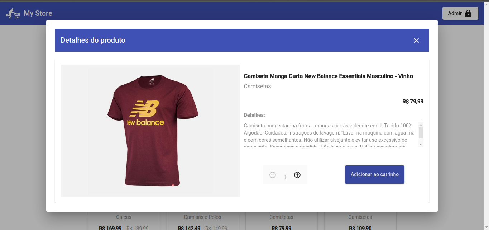
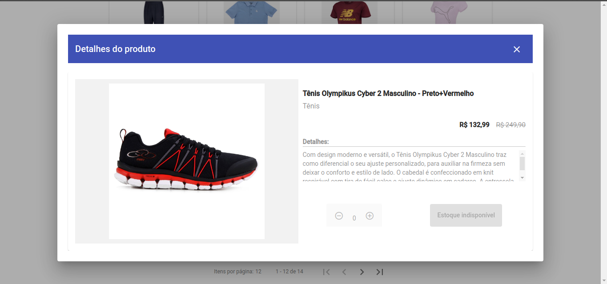
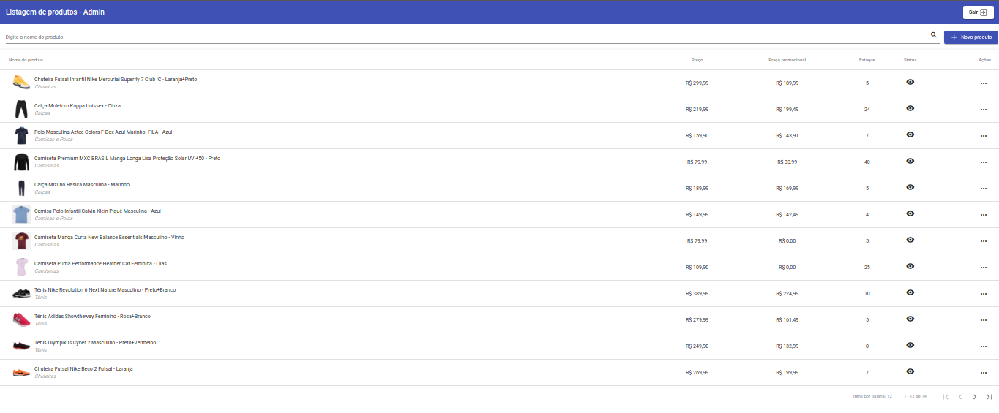
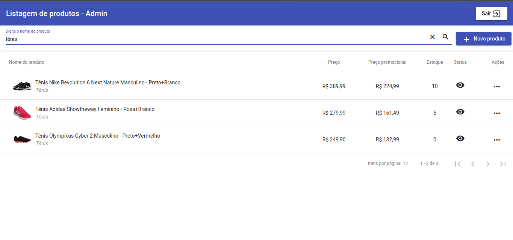
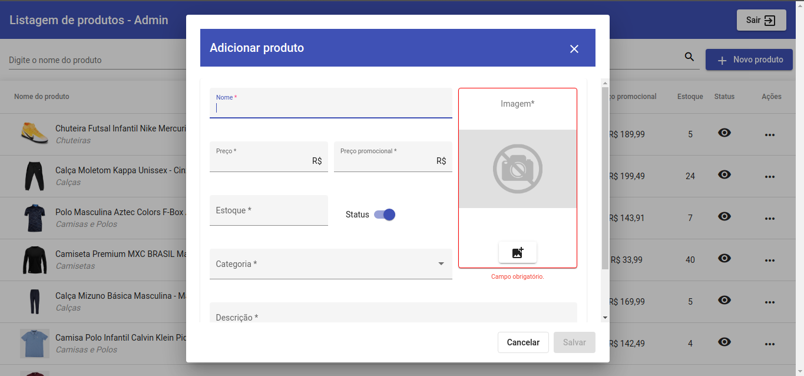
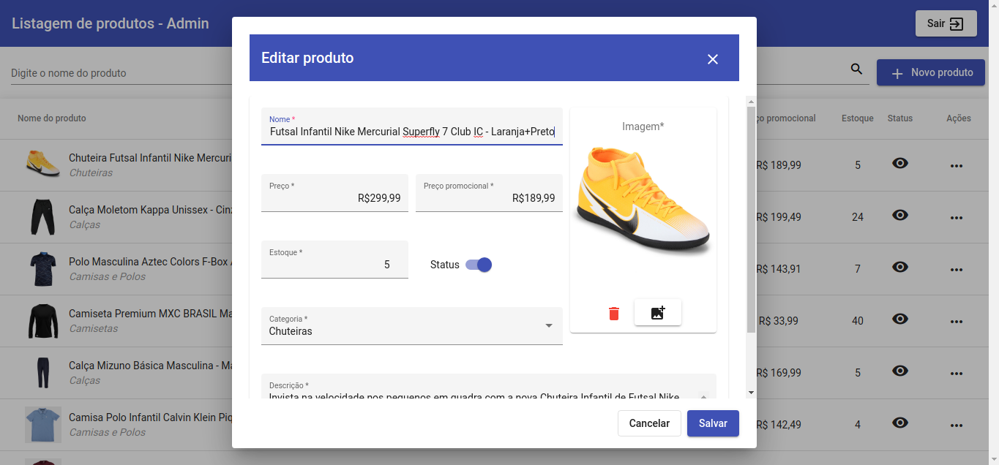

# Projeto My Store

My Store é um projeto simples de simulação de um e-commerce.
  

# Estrutura

A estrutura do projeto possui o frontend (Angular com Angular Material), o backend (NodeJS com Express, através do padrão Repository Pattern) e o banco de dados relacional (Sqlite).
  

# Telas

Veja abaixo os prints das telas disponíveis no sistema:

  

# Como executar

## Dentro do diretório backend, execute os seguintes comandos:

- ### Comando que instala as dependências necessárias do projeto
        npm install
 

- ### Comando que executa as migrations que irão criar as tabelas do banco de dados
        npm run migrations
 

- ### Comando que cria e/ou atualiza o Swagger
        npm run swagger
 

- ### Comando que inicia o servidor de backend na porta 3333.
        npm start
 

## Dentro do diretório frontend, execute o seguinte comando:

- ### Comando que instala as dependências necessárias do projeto
        npm install
 

- ### Comando que inicia o sistema de frontend na porta 4200. Para que o frontend funcione corretamente, o servidor de backend deverá estar funcionando, para que haja uma conexão entre os dois. 
        npm start

  

# Swagger

### O Swagger estará disponível através da url do servidor de backend, na rota /docs. Exemplo:
    http://localhost:3333/docs